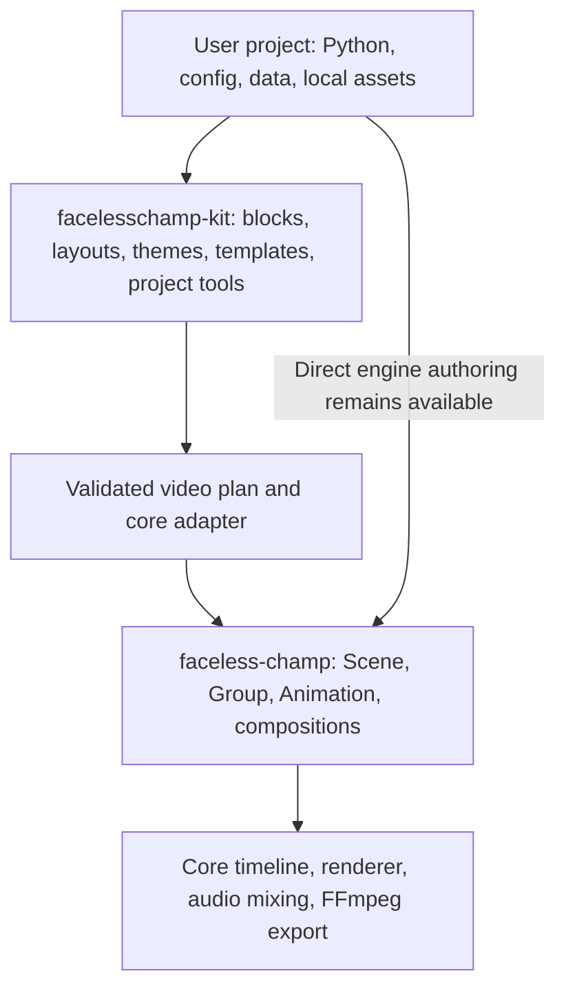

# facelesschamp-kit: architecture and implementation plan

Status: proposed design, ready to turn into implementation tasks.
Date: 2026-10-06.

The API examples, commands, versions, and directory layouts below are proposals.
`facelesschamp-kit` has not been implemented by this planning change.

## 1. Recommended direction

Build **facelesschamp-kit as a separately installable Python framework that depends
on faceless-champ**. Keep the current library usable on its own.

The framework should give developers a consistent way to create projects, compose
reusable video blocks, apply themes, resolve assets, synchronize narration, and
preview or export videos. Its output is an ordinary Faceless Champ composition.
Faceless Champ continues to evaluate time, rasterize frames, mix audio, and encode
the video.

The useful part of the React/Next.js analogy is the division of responsibility:
the underlying library supplies capabilities; the framework supplies conventions,
composition, and a complete workflow. For this project, reuse happens during video
construction. There is no need for a browser-style reconciliation loop.



Start with a complete 10–30 second workflow and a small collection of excellent
blocks. Use that workflow to establish the contracts needed for a larger catalog.

## 2. What the current repository already provides

This plan is based on the current checkout, rather than assuming a new engine:

| Existing capability | Source | Framework use |
| --- | --- | --- |
| Python 3.12+, distribution `faceless-champ`, version `0.1.0` | `../pyproject.toml` | Initial runtime and dependency compatibility baseline |
| `Scene`, `Scene.at()`, lifetimes, `Sequence`, `Grid`, `Layer` | `../src/faceless_champ/timeline.py` | Lower video definitions into existing compositions |
| Snapshot ownership and measured groups | `../src/faceless_champ/layout.py`, `timeline.py` | Assemble and lay out blocks before adding them |
| Text, numbers, shapes, images, image slots, equations | `../src/faceless_champ/components.py` | Primitive ingredients for reusable blocks |
| Motion presets, schedules, indicators, masks | `../docs/motion-graphics.md` | Build reusable motion recipes |
| Charts, flags, offline maps | `../src/faceless_champ/charts/`, `flags.py`, `maps.py` | Build data and geography sections without duplicating drawing |
| Exact SRT cues and highlighted captions | `../src/faceless_champ/subtitles.py` | Narration markers and caption styles |
| Source-clock ranged rendering and frame streaming | `../src/faceless_champ/export.py` | Shared preview and full-export workflow |
| Renderer protocol and bounded caches | `../src/faceless_champ/renderer.py` | Use existing rasterization and memory controls |
| Similar preview/storyboard CLIs across training projects | `../training project/` | Extract project tooling into the framework |

The core currently renders with Pillow and exports MP4 through FFmpeg. Its renderer
protocol is an extension point, but arbitrary new visual classes are not
automatically understood by the default renderer. Camera animation, video import,
and GPU rendering require separate engine work.

## 3. Package boundary

Use one-way dependencies:

```text
user projects / optional packs
              ↓
      facelesschamp-kit
              ↓
       faceless-champ
```

| Responsibility | Owner |
| --- | --- |
| Primitive components and renderable visual types | Core |
| Property interpolation, scheduling, time evaluation, ownership | Core |
| Renderer, audio mixing, codecs, streaming, export publication | Core |
| Reusable compositions such as cards, comparisons, and explainers | Kit |
| Theme tokens, semantic typography, safe areas, layout policies | Kit |
| Project config, scaffolding, preview, storyboard, catalog, validation | Kit |
| Named assets, manifests, provenance, reusable asset packs | Kit / packs |
| Whole-video templates and domain workflows | Kit / packs |
| Optional TTS, stock-media, and remote-render integrations | Optional integrations |

For example, an animated chart property belongs in the core. A reusable
`ChartStory` that combines a chart, headline, annotations, and chapter timing belongs
in the kit. A `MetricCard` combines existing Rectangle, Text, and Number components.

Keep the charts, maps, flags, and presets already shipped in the core available
there. New framework organization does not require moving or removing those APIs.
Add a core capability only when the kit exposes a concrete missing primitive or
public contract, with its own validation and compatibility review.

## 4. Distribution and repository structure

Recommended names:

| Purpose | Proposed name |
| --- | --- |
| Existing distribution / import | `faceless-champ` / `faceless_champ` |
| Framework distribution / import | `facelesschamp-kit` / `facelesschamp_kit` |
| Framework CLI | `fc-kit` |
| Project config | `facelesschamp.toml` |
| Future separately installed packs | e.g. `facelesschamp-kit-education` |

Check distribution-name availability before publishing. Use a separate repository
for the kit, with independently built wheels and releases. Develop against an
editable core checkout initially, then verify against built core wheels. The
current core repository can keep its existing layout and release process.

```text
facelesschamp-kit/
├── pyproject.toml
├── README.md
├── LICENSE
├── src/facelesschamp_kit/
│   ├── __init__.py
│   ├── project.py             # Config loading, video factory selection
│   ├── context.py             # Explicit per-build resources and settings
│   ├── video.py               # Video and segment definitions
│   ├── plan.py                # Validated placements and timed operations
│   ├── compiler.py            # Conversion to public core APIs
│   ├── diagnostics.py
│   ├── cli.py
│   ├── blocks/
│   │   ├── base.py
│   │   ├── text.py
│   │   ├── cards.py
│   │   ├── media.py
│   │   └── comparison.py
│   ├── layouts/
│   ├── motion/
│   ├── themes/
│   ├── assets/
│   ├── narration/
│   ├── templates/
│   └── tooling/               # Frames, storyboards, reports
├── examples/
├── tests/
├── docs/
└── llms.txt
```

This is the target organization. Introduce modules when their first capability
lands; an initial release does not need empty packages for every future feature.

Use Python 3.12+ to match the core. Prefer dataclasses, protocols, `tomllib`, and
`argparse` for the first version. Add dependencies when they serve a shipped
feature. Keep equations and maps as optional extras forwarded to the corresponding
core extras. Large assets should be separate, versioned packs rather than default
dependencies.

Initially support the tested core minor line, for example
`faceless-champ>=0.1.0,<0.2.0`. Raise the minimum if a required public API arrives in
a later patch. Widen compatibility only after testing it. Pin exact versions in
example lockfiles and record them in build reports.

## 5. Authoring model

Give each concept one purpose:

| Concept | Purpose |
| --- | --- |
| `Project` | Loads config, selects video factories, and manages build resources |
| `BuildContext` | Supplies a video's canvas, theme, assets, data, and seed |
| `Video` | Describes one output timeline with segments and optional narration |
| `Segment` | Defines a named time window containing placements and motion |
| `Block` | Creates a reusable arrangement of core components from typed props |
| `CompiledVideo` | Holds a core composition, manifest, and diagnostics |

A layout arranges blocks. A motion recipe produces core animations or schedules.
A template combines blocks, layout, and timing into a reusable video factory.

Use Python as the primary authoring interface. Use TOML for settings and factory
selection. Keep data in Python, JSON, or CSV through explicit loaders. A declarative
JSON video format can be added after the Python contracts stabilize.

### Proposed generated project

```text
my-video/
├── facelesschamp.toml
├── pyproject.toml
├── videos/
│   ├── __init__.py
│   └── main.py
├── components/                # Project-specific reusable blocks
├── assets/
│   ├── manifest.json
│   ├── images/
│   ├── fonts/
│   └── audio/
├── data/
├── output/
└── .fc-kit/                   # Generated cache and build reports
```

Output and cache directories are ignored by Git. Keep source media according to
the project's own versioning policy. Templates must not depend on a developer's
Desktop directory, sibling checkout, or current working directory.

```toml
schema_version = 1

[project]
name = "first-video"

[videos.main]
factory = "videos.main:build"
format = "shorts"
theme = "midnight"

[profiles.preview]
width = 540
height = 960
fps = 15

[profiles.final]
width = 1080
height = 1920
fps = 30
```

`shorts` selects a 1080×1920 design canvas. Themes control styling; render profiles
control exported dimensions and frame rate. Aspect ratio is preserved. Caption
visibility and decorative text are explicit template options.

### Proposed Python API

```python
# videos/main.py — target API; not runnable until the kit is implemented.
from facelesschamp_kit import Video
from facelesschamp_kit.blocks import Comparison, MetricCard


def build(ctx):
    video = Video(ctx)

    with video.segment("hook", start=0, duration=3) as segment:
        segment.add(
            MetricCard(value=42, label="Reusable components"),
            anchor="center",
            enter="pop",
        )

    with video.segment("comparison", start=3, duration=5) as segment:
        segment.add(
            Comparison(left="Repeated setup", right="Shared building blocks"),
            anchor="center",
            enter="stagger",
        )

    return video
```

`segment.add()` returns a block handle with named child handles and placement
metadata. The default lifetime is the segment's window; entry and exit recipes
must fit inside it. Raw core components can be placed through an explicit
`segment.add_core(component, ...)` path. Property animations target the retained
source handles and are scheduled through the same timeline validation.

Support existing core `Scene`, `Sequence`, `Grid`, and `Layer` factories as complete
video entries too. This provides a migration path for existing projects. Their
framework reports identify them as core-authored outputs; rich block-level
metadata is available only where the author supplies it.

## 6. Build and component contracts

Use a short, explicit pipeline:

```text
load config and selected factory
→ resolve referenced assets and data
→ construct video definition
→ measure layouts and normalize timed operations
→ validate
→ compile to core objects
→ preview / inspect / render
```

Asset references created inside the factory are resolved before the blocks that
consume them are measured. There should be no implicit network calls during these
steps.

Each block has typed props and a composition method, conceptually
`compose(context, props, bounds) -> BlockBuild`. `BlockBuild` contains a root core
component or Group, named child handles, measured bounds, and timed motion
descriptions. A fresh invocation creates fresh core component instances.

Required behavior:

- Validate props before adding components. Normalize mutable input data into
  immutable values or defensive copies.
- Resolve inherited styles in a documented order: framework defaults, project
  theme, block variant, explicit props.
- Assemble complete Group membership and initial layout before `Scene.add()`.
  The current engine snapshots components and forbids reparenting added members.
- Give placements stable, scoped IDs for diagnostics and manifests. Reusing a
  block definition creates a new placement, not shared animation ownership.
- Describe motion through public core animations and schedules. A kit block built
  from existing primitives does not require a renderer registration.
- Build into fresh core objects and publish `CompiledVideo` only after success.
  A failed compilation must not leave a reusable definition partially built.

The normalized plan is a small authoring record for placements, timings, and
diagnostics. It does not duplicate the core's property interpolation or invent a
second renderer. Core validation remains authoritative for engine behavior.
Do not depend on private attributes such as `Scene._objects` or modify engine
entries after construction.

For custom drawings, first compose existing primitives. A truly new visual type
requires a renderer that supports it or a separate core change. An extension to
the kit's block catalog alone cannot teach PillowRenderer a new primitive.

## 7. Timing and narration

Make the video clock explicit from the first implementation.

- Segment windows use absolute video seconds. Motion within a segment uses local
  seconds, translated exactly once: `global = segment.start + local`.
- Treat windows as `[start, end)`. Reject negative times, invalid durations,
  overlapping writes to the same property, and animations outside their lifetime.
- Order operations chronologically before lowering. Define stable ordering at a
  shared boundary, including creation before animation and ending the previous
  placement before replacing it.
- Preserve the core's rule that the same object's property tracks must be authored
  chronologically. Auto-layout finishes before snapshotting; animation changes
  evaluated state, not the source layout.
- Explicitly end placements at segment boundaries. Do not assume a Group or Layer
  will disappear when its associated narrative beat ends.

For the initial kit-authored timeline, compile segments into one core Scene using
`Scene.at()`, `add()`, `play()`, `remove()`, and `wait_until()`. This gives absolute
placement and predictable lifetimes without requiring a new offset composition.
Retain existing core compositions for core-authored entries and tested template
cases. Mixing arbitrary already-built scenes into timed segments can wait until
an explicit, tested adapter exists.

Add narration once on the master clock with `start=0`. Full-track Captions are
also added at time zero, because the current core interprets cue times relative
to a caption component's age. For layered compositions, a transparent master
audio/caption Scene can be composed through the existing Layer API.

Cue-driven authoring should use named markers backed by original one-based SRT
indices, rather than word search or cumulative estimated speech durations:

```python
# Later part of the proposed narration API.
voice = video.narration(
    audio=ctx.assets.audio("voiceover"),
    subtitles=ctx.assets.subtitle("word_cues"),
    markers={"hook": 1, "comparison": 54, "recap": 129},
)

with video.segment("comparison", window=voice.between("comparison", "recap")) as segment:
    segment.add(Comparison(left="Before", right="After"), enter="fade")
```

Keep original cue timestamps. Overlap tolerance is explicit and forwarded to
`SubtitleTrack`; it must not silently retime cues. Validate cue IDs, audio duration,
caption extent, and animation-window fit. Audio tails and subtitle gaps are reported
and handled by an explicit duration policy.

Visual transitions in a narrated timeline must fit the existing segment windows.
Do not shorten them through Sequence crossfades, which subtract overlap from
sequence duration. Use opacity transitions on the master clock and keep narration
independent. Sequential, unnarrated templates can deliberately use core crossfade
semantics and record the resulting offsets.

Preview a range by passing the compiled composition and source `start_time` /
`end_time` to the core exporter. Do not reconstruct the excerpt on a new clock.

## 8. Reusable catalog and design system

Organize the catalog by increasing scope:

| Level | Examples | Implementation |
| --- | --- | --- |
| Core primitives | Text, Image, Number, shapes, charts, maps | Existing engine APIs |
| Kit blocks | Heading, TextPanel, MetricCard, ImageCard, Comparison, StepList | Components + Group + measured layout |
| Kit sections | ChartStory, EquationExplain, MapFocus, TimelineStory | Several blocks + timed recipes |
| Video templates | Explainer Short, narrated chapter video, data story | Validated content inputs + sections |
| Packs | Education, finance, geography, branded styles | Separately versioned catalogs and assets |

For v0.1, ship six blocks: Heading, TextPanel, MetricCard, ImageCard, Comparison,
and StepList. Ship Stack and Split layouts, two themes, three entry recipes
(fade, pop, stagger), and two starter templates: a silent composition and a
narrated Short. Expand sections after the initial workflows pass verification.

Themes should extend the existing ColorScheme roles with typography, spacing,
corner radii, motion durations, chart styles, and caption styles. Resolve theme
objects once per build, without global mutable defaults.

Layouts measure using the core's bounds helpers. Reserve space for captions and
safe areas. Text fitting follows an explicit policy, such as wrap then shrink to a
minimum font size, otherwise fail with a useful error. Do not silently crop content.
Portrait and landscape layouts choose supported arrangements explicitly; changing
an export resolution only scales the same design canvas.

Every catalog entry needs documented props, examples, license information where
relevant, a thumbnail, and a short motion preview. Include long-text, missing-image,
theme, and supported aspect-ratio examples so the catalog shows practical limits.

## 9. Asset and template system

Create an `AssetRegistry` scoped to the project root. Support named local files and
installed pack resources first. Build on the core's Image/ImageSlot source support
and existing font, flag, and map resources.

An asset manifest records stable ID, type, relative path or package resource,
source, license/attribution, checksum, and optional media metadata. Keep filesystem
paths independent of the invoking working directory. Reject ambiguous IDs and
unsafe extraction paths when pack installation is eventually supported.

Use `importlib.resources` to access installed package assets. Resource paths
materialized through `as_file()` must stay alive throughout rendering or be copied
into a managed cache. Python documents these package-resource APIs in the
[standard library reference](https://docs.python.org/3.12/library/importlib.resources.html).

Missing media has an explicit mode: required, placeholder, or auto. Placeholders
are labeled in the video and report. Offer strict asset validation before final
export. Downloading or generating assets is a separate action that persists the
result and provenance before rendering.

Keep cache budgets configurable. Changed source files invalidate resolved assets
and create a fresh core renderer, matching the current core's asset-cache behavior.
The first version needs resolved-asset and storyboard caches; resumable export can
be designed later with explicit engine support.

Templates are ordinary Python factories with versioned input contracts. Distinguish
project scaffolds, which copy editable starter files, from callable video templates,
which compose data into a Video definition. Template updates never rewrite an
existing user's project automatically.

Data templates validate category identity, units, missing observations, and axis
limits before creating core charts. Preserve the distinction between missing data
and zero. Synthetic datasets keep a persistent visible label and provenance in
the build manifest.

## 10. Framework workflow and CLI

Use the same Python services for CLI commands and programmatic calls:

```bash
# Proposed commands, not currently available.
fc-kit init my-video --template explainer-short
fc-kit doctor
fc-kit list videos
fc-kit list blocks
fc-kit validate main --strict-assets
fc-kit inspect main --json
fc-kit frame main --time 2.5 -o output/frame.png
fc-kit storyboard main -o output/storyboard
fc-kit preview main --segment hook -o output/hook.mp4
fc-kit preview main --start 3 --end 8 -o output/excerpt.mp4
fc-kit render main --profile final -o output/main.mp4
```

`init` checks all destination conflicts before writing files. Export follows the
core's explicit-overwrite behavior. A named segment preview uses the compiled
segment boundaries. A default preview uses the scaffold's documented preview
window or a bounded opening interval, while `render` exports the whole video.

`doctor` checks Python, the installed core/kit versions, optional capabilities,
FFmpeg/ffprobe, the required encoder, and writable output/cache locations.
`validate` checks authoring and assets; `frame` performs raster validation;
`preview` checks a selected media interval; none of those alone proves full export.

Build reports use a versioned JSON schema and include video ID, segment windows,
resolved cue references, assets/checksums, theme, canvas, export profile, tool
versions, diagnostics, and output metadata. Human errors name the video, segment,
placement, failing input, and a concrete correction. Machine output uses stable
error codes and nonzero exit statuses.

Deterministic builds use explicit seeds and immutable inputs. Record hashes of
config, source modules, data, resolved assets, dependencies, and export settings.
Treat fingerprints as build/cache identity; do not promise byte-identical MP4s
across different encoder, font, or platform versions. Custom factory dependencies
need explicit declaration or conservative cache invalidation.

## 11. Extension strategy

For v0.1, custom blocks, themes, and templates are explicit Python imports. The
registry belongs to the BuildContext or Project, rather than process-global state.
Define these contracts before designing general hooks.

After external packs have demonstrated those contracts, discover installed plugins
through a group such as `facelesschamp_kit.plugins`. Entry points are Python's
standard mechanism for distributions to advertise discoverable components; the
consumer defines the interface and duplicate-name policy. See the
[PyPA entry-points specification](https://packaging.python.org/en/latest/specifications/entry-points/).

Each plugin declares a unique ID, plugin API version, compatible kit/core range,
and provided blocks/themes/templates/assets. Discovery can read metadata without
executing every plugin. Load only enabled plugins, and reject collisions unless
the project explicitly selects an override. Plugins cannot bypass core ownership
or renderer constraints.

Put TTS, stock-media, AI-image, and cloud-render providers behind optional packages.
Separate media preparation from rendering, with explicit saved inputs and outputs.
Graphical editing, camera systems, GPU rendering, and video decoding are separate
projects with engine implications, rather than prerequisites for the kit.

## 12. Implementation phases

Each phase should leave a runnable example and update the docs for its actual API.

| Phase | Work | Completion gate |
| --- | --- | --- |
| 0. Prove the boundary | Create kit package skeleton; document core compatibility; build a tiny core-only factory through the kit | Installed kit wheel can render a core-authored example without private engine access |
| 1. Build the vertical slice | Project config, context, Video/Segment/Block contracts, minimal plan/compiler, one MetricCard, one theme, validate/frame/preview/render | Scaffold → edit props → render an 8–12 second Short works end to end |
| 2. Make reuse practical | Asset registry, six blocks, Stack/Split layouts, two themes, fade/pop/stagger, props and fitting errors | Reuse a block twice with independent motion; change theme and format without duplicating its drawing logic |
| 3. Support narration | Original SRT markers, master narration/captions, segment/window reports, ranged previews, storyboard | 30-second narrated example and a late excerpt preserve the original visual/audio clock |
| 4. Establish release quality | Wheel/clean-install checks, offline assets, compatibility CI, media QA, docs, CLI contracts, catalog previews | Both starter templates work from an installed wheel in an unrelated directory; publish a tested v0.1 candidate |
| 5. Expand the catalog | ChartStory, EquationExplain, MapFocus, TimelineStory; extract reusable training-project patterns | Each section has typed data, assets, docs, renderable demo, and inspection evidence |
| 6. Open extension points | Separate packs, plugin metadata/compatibility, explicit provider integrations | An independently built pack installs and works without modifying kit or core source |
| 7. Improve iteration | Optional file watching, local gallery/preview interface, batch outputs, measured caching and remote execution | Changes rebuild the affected output with correct dependency invalidation and documented resource limits |

Phases 0–4 define the first release. Later phases can ship as independent releases.
Use estimates only after the vertical slice establishes layout and compilation
cost; asset curation and visual QA are substantial work in their own right.

### First concrete implementation backlog

1. Create the separate package with matching Python support, a core dependency,
   `fc-kit` console entry point, README, and license decision.
2. Write one compact architecture decision recording package ownership, timing,
   snapshot lifetimes, and compatibility policy.
3. Implement validated config and video-factory loading from a project root.
4. Implement BuildContext and two concrete result types: Video definition and
   CompiledVideo. Keep build state scoped to one invocation.
5. Implement absolute segment windows, fresh placement handles, and normalized
   add/play/remove events lowered through public Scene methods.
6. Implement MetricCard from existing core Rectangle/Text/Number and Group.
7. Add one theme and center/stack placement with measured text fitting.
8. Implement `validate`, `frame`, `preview`, and `render` through shared services.
9. Generate a runnable starter project and inspect its stills and full short export.
10. Build the kit wheel, install it with the core wheel into a clean environment,
    and run the starter from outside both source trees.

Only expand the module and catalog surface after this backlog demonstrates that
the framework reduces repeated authoring work.

## 13. Verification and release gates

Focus tests on contracts and visible failure modes:

| Area | Required evidence |
| --- | --- |
| Timing | Segment-to-global mapping, shared boundaries, lifetimes, conflicting property writes, cue indices |
| Ownership | Two placements create independent core instances; group layout occurs before addition; failed builds can be retried cleanly |
| Narration | Cue timestamps remain unchanged; source-clock range output matches expected visual times and audio placement |
| Layout | Long labels, minimum font sizes, measured bounds, safe areas, supported portrait/landscape arrangements |
| Assets | Missing/placeholder/required modes, unrelated working directory, changed-file invalidation, pack resource lifetime |
| CLI/config | Unknown fields, invalid profiles, useful exit codes, JSON diagnostics, destination conflicts, explicit overwrite |
| Extensions | Pack compatibility, duplicate IDs, enabling/loading policy, missing optional dependencies |
| Media | ffprobe dimensions/fps/duration/audio streams, full FFmpeg decode, inspected representative frames |
| Packaging | Build wheel/sdist, clean install, bundled licenses/resources, optional extras, no source-tree-only imports |
| Performance | A representative long timeline with bounded frame/asset caches; no retained list of all video frames |

Use unit tests for timing and normalization, integration tests against real core
objects, and a small fixed-environment set of visual regression renders. Review
real frames as well as automated results. Do not make broad image snapshots of
every props combination the foundation of the test suite.

Before v0.1, fully export both a silent 8–12 second video and a narrated 30-second
video, inspect frames, decode both files, and verify a late ranged preview. Record
exact settings and environment. A 4K smoke render is a separate result; any
claimed long-form or full 4K support needs a representative complete export.

The release is ready when a developer can install the kit, scaffold a project,
change content and theme, reuse a custom block, preview one segment, and export
the complete video without copying rendering or asset-resolution code.

## 14. Migration and growth

Use the existing examples as source material, with each extraction reviewed for
general usefulness:

- Shared training-project `render.py` logic becomes preview/storyboard/report tools.
- Country Economy's cards, palette, image slots, and cue-derived chapters become
  themed blocks and narration helpers.
- Good Math's repeated layout and narration patterns become an educational template.
- Company Growth becomes a data-story template around the existing RankedBarChart.
- Existing maps and equation demos become geography and equation sections.

Keep original examples runnable during migration. Compare representative frames,
timing manifests, and audio placement before and after extraction. Shared drawing
and timeline behavior remains in the core; shared composition and workflow moves
into the kit. Project-specific data and narration remain in user projects.

The first architectural success is a small framework that makes complete videos
easier to author and verify. A large reusable catalog then grows on top of proven
component, timing, asset, and packaging contracts.
